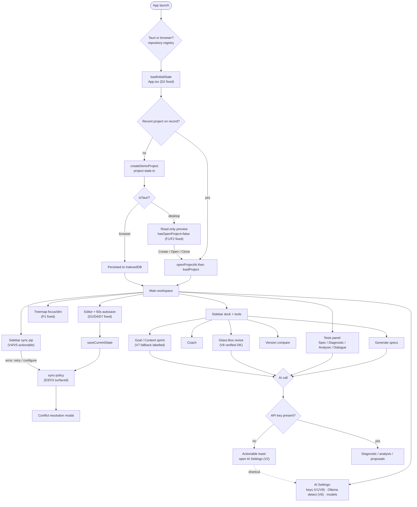

# TreemapWriter2 — Tauri UX Audit (point-in-time)

> **What this is.** A one-time audit of the desktop (Tauri) user flow, the
> issues found across it, and how each was resolved. Unlike the evergreen docs
> ([VISION](VISION.md) / [AGENTS](../AGENTS.md) / [STATUS](../STATUS.md)), this
> is a **dated snapshot**, not a living inventory — the canonical record of the
> fixes is the code and [migration-log.md](migration-log.md). Read this to
> understand the shape of the app's flow and the class of bugs the piecemeal
> (vibe-coded) history left behind.
>
> **Audited & remediated 2026-06-18.** Findings were verified against the code
> before any change; a few turned out to be non-issues (called out below).

## How the app flows (and where it broke)

The diagram traces launch → runtime detection → initial load → project entry →
the main workspace loops → sync → settings. Markers (`D#`, `V#`, `F#`, `P#`) tie
each issue to where it lives; all are resolved unless marked *deferred*.

[View / edit the rendered diagram](https://mermaid.ai/live/edit#pako:eNptVU1vGzcQ/SuDPckI5K2TNG2NJobirVvBKSxYhnKwcqC4I4kxxVmQXNtCkN/Ve39ZZ0hKlt2clhzOe2++yP1WaWqxOq2Wlh70WvkIN83cAXxSvdPrwe2o68Cm9ZcjGA4/QIMRdfw2r25U7w2Qh4Wnh4D+7PeFrz947CiYSH479LgyIfrtvPoujBmYOD6Ram/nleXP2JlolJ1GFTERsOBxDI8waF7D0jxiezSvvqSI2Duh/1KB5a9Ro4vQefoqtOTAoybfnhU59mJv2GJIoKsOHUsSfyYZMooQ1+hAoiimolSgjkrCG2Kk9sghyqY4p2iL/DBI/Bx3YRC3PfjSuJYDNiFV7GxfjnwiSvOqxXAXqZtXCTXxeG/w4VayVO2QnN1yosmWVNcqXD0l8n6pbEAYXJzUFy9q9lykNGongj5wf1A6sV9DJBi7Fpmj+VhIRCohPk/Z9W9lHDyQvwud0lhcnvDZL9lywFn6PFUP6kxWw7klhyUQMc2dQD5Pk-GPVgaItfICXsG7nwKoPlJQ93lKBs1J3bytm1-e51sIbjziRnXMUFawJN2HujWbjJ6c_BDXkL5j0NS0uFAeWt6yeCSy4YUAhhiEXr7QKYf2NDFPO9ScXmPUylGIRjYjp_yWy5PtllY9Pmebbp2emO5AObAFOtPlaGdv69nPoHQ05NTCYo469VciTBSsKwH9iQ69VDqIYTcFO69zUnrNXun78vCa2xVQOKwKYfiRHsEnUwniV7hHb5aGm3x1efR_6k2nvMBnMgt8HXW2vHScdt64KDKkrEwCuSgXOSR70eK2KmsXijFWLdDaXauEqkxFIuN5YCoZi_Pee-ZJD0nRlNN9gcWNP8OOrNHbMkRv6tkbCL1f8ijvh0G8S05uyc4xVSwvuSSBbC-dgA21yh5guIV52NF78qfsyo8fZ6gZa1a93827-OZMUteSbTTmF2I0Bs1plwciz1Y-lH3uz4EhV_LAwHjZXOJWyCZjuMP0bgSuy-7Z4cMcpKMSzoUyljMc7ceLB16FmOdZ3kvhnWKMxq0CDGavd3XaU_EbW7iuMfRW6vXsAqinC8DvJf8fVLlPh3egCNymMux2OQhOQ4RP6tlvR_DvP3BlrdooaPMPZTB7l6zcDtzfU0kKhsccXFiTj7rntx2OD3Tmrvr-H85iSAI=)

## Findings & resolutions

Severity tiers: **D** = data safety · **V** = silent-failure visibility ·
**F** = first-run/empty-state · **P** = polish.

### Tier D — data safety

| ID | Where | Symptom | Resolution |
|----|-------|---------|------------|
| D1 | `App.tsx` autosave interval | 60 s `saveCurrentState`/`createSnapshot` fired unawaited; a slow save could overlap the next tick and clobber it; rejections unhandled. | In-flight `useRef` guard skips a tick while a save is pending; the body is awaited inside a `try/catch`. |
| D2 | `App.tsx` `loadInitialState()` | No `.catch`; `migrateVeryOldLegacy` could throw and leave the app half-initialized, silently. | `.catch` → toast; `isFirstRender` reset in `.finally`. |
| D3 | `App.tsx` `initSyncPolicy()` | `void`-swallowed rejection (corrupt repo / perms) → sync silently dead. | `.catch` → sets sync status to `error` with a message. |
| D4 | `project-state.ts` `saveCurrentState` | A save resolving *after* a fast project switch converged the old project's prose onto the newly-opened one. | Capture `activeProjectId` at entry; re-read after the `await` and abort the store convergence if it changed. |
| D5 | `App.tsx` vs `document-state.ts` | A duplicate `updateSectionGoals` `useCallback` (empty `[]` deps → stale closure over `createSnapshot`) ran alongside the canonical slice action — two codepaths, possible double snapshot. | Deleted the App.tsx copy; modals + panels now share the one `document-state` action. |
| D6 | `App.tsx` test-suite cleanup | A cleanup `useEffect` was commented out because it deleted real data when a (title-derived) section id changed; orphans then grew unbounded. | New `pruneOrphanEntries` slice action removes **only** orphans with no authored content — renames/reorders keep their specs/goals/history. (Full fix still wants stable IDs; see STATUS.) |
| D7 | `App.tsx` `handleSaveContent` | Content-sprint splice never persisted (≤60 s loss window) and carried a "does newContent include the header?" uncertainty comment. | Reads the live buffer fresh, guards a missing section with a toast, persists immediately via `saveCurrentState`; comment resolved. |

### Tier V — make silent failures visible

| ID | Where | Symptom | Resolution |
|----|-------|---------|------------|
| V1 | `ai-provider-registry.ts` | Keyring lookup failure `.catch(() => {})` — on desktop, indistinguishable from "no key set". | Desktop failures now log a distinct warning explaining the env fallback; browser stays silent (expected). |
| V2 | LLM clients + AI call sites | Missing/invalid key only failed at call time with a generic "check your connection and API key". | New `features/shared/ai-error.ts` `notifyAiError` detects key errors and shows a specific message with a one-click **AI Settings** action. Wired into interpolate, diagnostic, spec-refine, suggestions, revision, analysis, and dialogue. |
| V3 | `sync-policy.ts` external-change check | Read failure was console-only. | One-shot toast (re-armed after a successful check) so it can't spam on every focus. |
| V4 | `sync-status.ts` / Sidebar | A latched error indicator wasn't actionable. (It already auto-clears on the next successful sync — that's deliberate.) | The error pip is now a button: click to **retry** (`retrySync`). |
| V5 | Sidebar + `sync.rs` | The "no GitHub PAT" error offered no path back to setup. | When the latched error is the PAT class, the pip click opens `SyncConfigModal` instead of retrying. |
| V6 | `AiSettingsSection.tsx` Ollama "Detect" | Silent on timeout/CORS. | Async handler with success/empty/failure toasts (failure names the `OLLAMA_ORIGINS` hint). |
| V7 | `sprint/SprintBrief.tsx` | On AI failure it showed a fallback plan under a "Generated plan" header + an error — ambiguous. | Tracks `isFallback`; the card relabels to "Default plan · coach offline". |
| V9 | `AiSettingsSection.tsx` | Saving a key cleared the field with no proof it persisted. | A "✓ stored" badge (driven by a `getSecret` presence check) shows when a key is in the keyring. |

### Tier F — first-run / empty state

| ID | Where | Symptom | Resolution |
|----|-------|---------|------------|
| F1 | `EditorPanel.tsx` / `project-state.ts` | The desktop demo has content, so the existing "Start a Project" CTA never showed; the editor stayed editable and the tutorial fired over it → typed work was lost. | When `isTauri() && !hasOpenProject`, the editor is **read-only** and the "Start a Project" CTA always shows (with preview-specific copy). No data can be lost in the preview. |
| F2 | `EditorPanel.tsx` toolbar | History / Snapshot / Revise acted on an on-disk project that doesn't exist in the preview. | Those persistence/AI affordances are hidden while in the preview state. |

### Tier P — polish

| ID | Where | Symptom | Resolution |
|----|-------|---------|------------|
| P1 | `Treemap.tsx` | Focus-mode dimming (0.015 bg / width-1 / 0.3 font) made unselected sections all but invisible — focus erased the structure. | Raised to legible values (≈0.09 bg / 1.5 / 0.55) that still recede behind the selection. |
| P2 | `ContentSuggestionsModal.tsx` | Opening the modal auto-fired an AI call (and burned tokens) without consent. | First generation now waits for an explicit "Generate suggestions" button. |
| P3 | `App.tsx` import/load | No success feedback after importing markdown / loading a project. | Success toasts added. |

### Verified non-issues (no change needed)

These audit candidates were checked against the code and found already correct —
recorded so a future pass doesn't re-investigate:

- **P4 — SpecGeneratorModal "Edit Prompt" loses the instruction.** It doesn't:
  `instruction` is only reset on modal open, so the edit↔diff toggle preserves it.
- **P5 — sprint-cues toggle "undiscoverable".** `SprintRunner` already has a
  "Toggle cues" button — the contextually-right place for it.
- **V8 — revision/compare workspaces "have no error state".** Both
  `use-revision-actions` and `use-analysis-actions` toast on every failure path
  and reset their phase; they are not silently-empty. (They were still upgraded
  to `notifyAiError` for the V2 shortcut, above.)
- **GrimoireModal "unreachable".** It opens from `AnalysisTab`, not the dock.

### Deferred (out of scope for this pass)

- **P6 — model-catalog fallback.** Making `resolveModelChoice` validate against
  the catalog would break its deliberate purity (it is pure + unit-tested) for a
  narrow edge case (a user deletes a custom model still referenced by an
  override). Left as a known limitation.
- **P5 (second half) — a global prompt-overrides editor.** A larger lift whose
  value is unclear against the project's "fewer choices" ethos; per-project
  prompt edits already exist via the raw-JSON `ProjectFileModal`.
