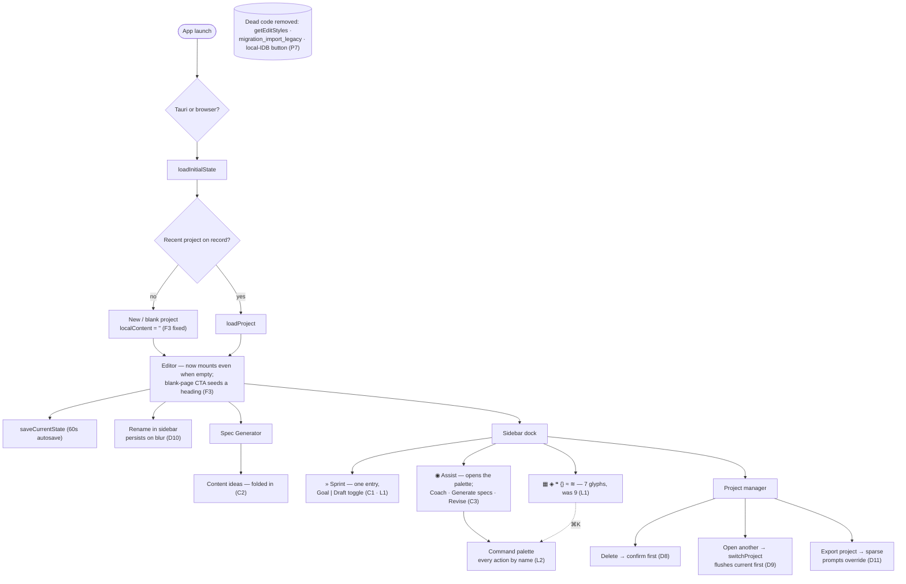

# TreemapWriter2 — Tauri UX Audit (point-in-time)

> **What this is.** A one-time audit of the desktop (Tauri) user flow, the
> issues found across it, and how each was resolved. Unlike the evergreen docs
> ([VISION](VISION.md) / [AGENTS](../AGENTS.md) / [STATUS](../STATUS.md)), this
> is a **dated snapshot**, not a living inventory — the canonical record of the
> fixes is the code and [migration-log.md](migration-log.md). Read this to
> understand the shape of the app's flow and the class of bugs the piecemeal
> (vibe-coded) history left behind.
>
> **Audited & remediated 2026-06-18.** Findings were verified against the code
> before any change; a few turned out to be non-issues (called out below).

## How the app flows (and where it broke)

The diagram traces launch → runtime detection → initial load → project entry →
the main workspace loops → sync → settings. Markers (`D#`, `V#`, `F#`, `P#`) tie
each issue to where it lives; all are resolved unless marked *deferred*.

[View / edit the rendered diagram](https://mermaid.ai/live/edit#pako:eNptVU1vGzcQ/SuDPckI5K2TNG2NJobirVvBKSxYhnKwcqC4I4kxxVmQXNtCkN/Ve39ZZ0hKlt2clhzOe2++yP1WaWqxOq2Wlh70WvkIN83cAXxSvdPrwe2o68Cm9ZcjGA4/QIMRdfw2r25U7w2Qh4Wnh4D+7PeFrz947CiYSH479LgyIfrtvPoujBmYOD6Ram/nleXP2JlolJ1GFTERsOBxDI8waF7D0jxiezSvvqSI2Duh/1KB5a9Ro4vQefoqtOTAoybfnhU59mJv2GJIoKsOHUsSfyYZMooQ1+hAoiimolSgjkrCG2Kk9sghyqY4p2iL/DBI/Bx3YRC3PfjSuJYDNiFV7GxfjnwiSvOqxXAXqZtXCTXxeG/w4VayVO2QnN1yosmWVNcqXD0l8n6pbEAYXJzUFy9q9lykNGongj5wf1A6sV9DJBi7Fpmj+VhIRCohPk/Z9W9lHDyQvwud0lhcnvDZL9lywFn6PFUP6kxWw7klhyUQMc2dQD5Pk-GPVgaItfICXsG7nwKoPlJQ93lKBs1J3bytm1-e51sIbjziRnXMUFawJN2HujWbjJ6c_BDXkL5j0NS0uFAeWt6yeCSy4YUAhhiEXr7QKYf2NDFPO9ScXmPUylGIRjYjp_yWy5PtllY9Pmebbp2emO5AObAFOtPlaGdv69nPoHQ05NTCYo469VciTBSsKwH9iQ69VDqIYTcFO69zUnrNXun78vCa2xVQOKwKYfiRHsEnUwniV7hHb5aGm3x1efR_6k2nvMBnMgt8HXW2vHScdt64KDKkrEwCuSgXOSR70eK2KmsXijFWLdDaXauEqkxFIuN5YCoZi_Pee-ZJD0nRlNN9gcWNP8OOrNHbMkRv6tkbCL1f8ijvh0G8S05uyc4xVSwvuSSBbC-dgA21yh5guIV52NF78qfsyo8fZ6gZa1a93827-OZMUteSbTTmF2I0Bs1plwciz1Y-lH3uz4EhV_LAwHjZXOJWyCZjuMP0bgSuy-7Z4cMcpKMSzoUyljMc7ceLB16FmOdZ3kvhnWKMxq0CDGavd3XaU_EbW7iuMfRW6vXsAqinC8DvJf8fVLlPh3egCNymMux2OQhOQ4RP6tlvR_DvP3BlrdooaPMPZTB7l6zcDtzfU0kKhsccXFiTj7rntx2OD3Tmrvr-H85iSAI=)

## Findings & resolutions

Severity tiers: **D** = data safety · **V** = silent-failure visibility ·
**F** = first-run/empty-state · **P** = polish.

### Tier D — data safety

| ID | Where | Symptom | Resolution |
|----|-------|---------|------------|
| D1 | `App.tsx` autosave interval | 60 s `saveCurrentState`/`createSnapshot` fired unawaited; a slow save could overlap the next tick and clobber it; rejections unhandled. | In-flight `useRef` guard skips a tick while a save is pending; the body is awaited inside a `try/catch`. |
| D2 | `App.tsx` `loadInitialState()` | No `.catch`; `migrateVeryOldLegacy` could throw and leave the app half-initialized, silently. | `.catch` → toast; `isFirstRender` reset in `.finally`. |
| D3 | `App.tsx` `initSyncPolicy()` | `void`-swallowed rejection (corrupt repo / perms) → sync silently dead. | `.catch` → sets sync status to `error` with a message. |
| D4 | `project-state.ts` `saveCurrentState` | A save resolving *after* a fast project switch converged the old project's prose onto the newly-opened one. | Capture `activeProjectId` at entry; re-read after the `await` and abort the store convergence if it changed. |
| D5 | `App.tsx` vs `document-state.ts` | A duplicate `updateSectionGoals` `useCallback` (empty `[]` deps → stale closure over `createSnapshot`) ran alongside the canonical slice action — two codepaths, possible double snapshot. | Deleted the App.tsx copy; modals + panels now share the one `document-state` action. |
| D6 | `App.tsx` test-suite cleanup | A cleanup `useEffect` was commented out because it deleted real data when a (title-derived) section id changed; orphans then grew unbounded. | New `pruneOrphanEntries` slice action removes **only** orphans with no authored content — renames/reorders keep their specs/goals/history. (Full fix still wants stable IDs; see STATUS.) |
| D7 | `App.tsx` `handleSaveContent` | Content-sprint splice never persisted (≤60 s loss window) and carried a "does newContent include the header?" uncertainty comment. | Reads the live buffer fresh, guards a missing section with a toast, persists immediately via `saveCurrentState`; comment resolved. |

### Tier V — make silent failures visible

| ID | Where | Symptom | Resolution |
|----|-------|---------|------------|
| V1 | `ai-provider-registry.ts` | Keyring lookup failure `.catch(() => {})` — on desktop, indistinguishable from "no key set". | Desktop failures now log a distinct warning explaining the env fallback; browser stays silent (expected). |
| V2 | LLM clients + AI call sites | Missing/invalid key only failed at call time with a generic "check your connection and API key". | New `features/shared/ai-error.ts` `notifyAiError` detects key errors and shows a specific message with a one-click **AI Settings** action. Wired into interpolate, diagnostic, spec-refine, suggestions, revision, analysis, and dialogue. |
| V3 | `sync-policy.ts` external-change check | Read failure was console-only. | One-shot toast (re-armed after a successful check) so it can't spam on every focus. |
| V4 | `sync-status.ts` / Sidebar | A latched error indicator wasn't actionable. (It already auto-clears on the next successful sync — that's deliberate.) | The error pip is now a button: click to **retry** (`retrySync`). |
| V5 | Sidebar + `sync.rs` | The "no GitHub PAT" error offered no path back to setup. | When the latched error is the PAT class, the pip click opens `SyncConfigModal` instead of retrying. |
| V6 | `AiSettingsSection.tsx` Ollama "Detect" | Silent on timeout/CORS. | Async handler with success/empty/failure toasts (failure names the `OLLAMA_ORIGINS` hint). |
| V7 | `sprint/SprintBrief.tsx` | On AI failure it showed a fallback plan under a "Generated plan" header + an error — ambiguous. | Tracks `isFallback`; the card relabels to "Default plan · coach offline". |
| V9 | `AiSettingsSection.tsx` | Saving a key cleared the field with no proof it persisted. | A "✓ stored" badge (driven by a `getSecret` presence check) shows when a key is in the keyring. |

### Tier F — first-run / empty state

| ID | Where | Symptom | Resolution |
|----|-------|---------|------------|
| F1 | `EditorPanel.tsx` / `project-state.ts` | The desktop demo has content, so the existing "Start a Project" CTA never showed; the editor stayed editable and the tutorial fired over it → typed work was lost. | When `isTauri() && !hasOpenProject`, the editor is **read-only** and the "Start a Project" CTA always shows (with preview-specific copy). No data can be lost in the preview. |
| F2 | `EditorPanel.tsx` toolbar | History / Snapshot / Revise acted on an on-disk project that doesn't exist in the preview. | Those persistence/AI affordances are hidden while in the preview state. |

### Tier P — polish

| ID | Where | Symptom | Resolution |
|----|-------|---------|------------|
| P1 | `Treemap.tsx` | Focus-mode dimming (0.015 bg / width-1 / 0.3 font) made unselected sections all but invisible — focus erased the structure. | Raised to legible values (≈0.09 bg / 1.5 / 0.55) that still recede behind the selection. |
| P2 | `ContentSuggestionsModal.tsx` | Opening the modal auto-fired an AI call (and burned tokens) without consent. | First generation now waits for an explicit "Generate suggestions" button. |
| P3 | `App.tsx` import/load | No success feedback after importing markdown / loading a project. | Success toasts added. |

### Verified non-issues (no change needed)

These audit candidates were checked against the code and found already correct —
recorded so a future pass doesn't re-investigate:

- **P4 — SpecGeneratorModal "Edit Prompt" loses the instruction.** It doesn't:
  `instruction` is only reset on modal open, so the edit↔diff toggle preserves it.
- **P5 — sprint-cues toggle "undiscoverable".** `SprintRunner` already has a
  "Toggle cues" button — the contextually-right place for it.
- **V8 — revision/compare workspaces "have no error state".** Both
  `use-revision-actions` and `use-analysis-actions` toast on every failure path
  and reset their phase; they are not silently-empty. (They were still upgraded
  to `notifyAiError` for the V2 shortcut, above.)
- **GrimoireModal "unreachable".** It opens from `AnalysisTab`, not the dock.

### Deferred (out of scope for this pass)

- **P6 — model-catalog fallback.** Making `resolveModelChoice` validate against
  the catalog would break its deliberate purity (it is pure + unit-tested) for a
  narrow edge case (a user deletes a custom model still referenced by an
  override). Left as a known limitation.
- **P5 (second half) — a global prompt-overrides editor.** A larger lift whose
  value is unclear against the project's "fewer choices" ethos; per-project
  prompt edits already exist via the raw-JSON `ProjectFileModal`.

---

## 2026-06-22 — Second Pass

> **A second dated snapshot.** The first pass (above) closed the data-loss and
> silent-failure class. This pass targets what was left: a fresh project that
> couldn't be typed into, gaps in the project-management flow, an illegible
> glyph-only dock with no keyboard access, three overlapping AI doors, and
> accreted dead code. As before, every finding was verified against the code
> before any change. **Scope:** dead code, legibility / discoverability,
> AI-surface consolidation, the project-management flow, and the empty-document
> condition. The Climate workspace was reviewed and **kept** (not a redundancy).

### How the flow changed (second pass)

The diagram retraces launch → load → project entry → the workspace, foregrounding
the second-pass markers. Two tiers join the original four: **L** = legibility /
discoverability and **C** = consolidation (surface-area reduction). All are
resolved unless marked *deferred*.

### Findings & resolutions (second pass)

Severity tiers (this pass): **D** = data safety · **F** = first-run/empty-state ·
**L** = legibility / discoverability · **C** = consolidation · **P** = polish
(incl. dead code).

#### Tier F — first-run / empty state

| ID | Where | Symptom | Resolution |
|----|-------|---------|------------|
| F3 | `EditorPanel.tsx` / `project-state.ts` | A brand-new project seeds empty content (browser `localContent: ''`; Tauri `project_create` writes an empty `project.md`), but the editor mounted **only when non-empty**, and the lone "Start with a blank page" CTA called `.focus()` on the unmounted editor — so a fresh project couldn't be typed into on either runtime; the only escape was importing a markdown file. | The editor mounts whenever a project is open (gated on the desktop preview `needsProject`, not on emptiness); the CTA seeds a `# ` heading and focuses, so a treemap node + section appear at once. |

#### Tier D — data safety

| ID | Where | Symptom | Resolution |
|----|-------|---------|------------|
| D8 | `ProjectManagerModal.tsx` → `App.tsx` | Project delete fired immediately — the modal's own "delete asks once — the only thing here that does" copy was aspirational; the handler called `deleteProject` directly. | Routed through the existing `requestConfirm`/`ConfirmModal` with runtime-specific copy (desktop forgets the recent entry, folder kept; browser is permanent). `ConfirmModal` bumped to `z-[110]` so it sits above the open Projects modal. |
| D9 | `App.tsx` Projects modal · `project-state.ts` | Switching projects called `loadProject` without flushing the current one, so up to 60 s of edits (since the last autosave) were lost on switch. | New `switchProject` thunk awaits `saveCurrentState` then `loadProject`; it composes with the D4 in-flight convergence guard (left untouched). |
| D10 | `Sidebar.tsx` | The project-name input only persisted on the next 60 s autosave; an immediate switch/close dropped the rename. | Persists on blur (subscribes to `saveCurrentState` directly), restoring "Untitled Project" if the field is cleared. |
| D11 | `App.tsx` `handleExportProject` | The `.socratic` export wrote the **resolved** prompts config, baking this machine's global tier into every field — so a re-import could never inherit a different machine's globals. | Extracted a pure, unit-tested `buildProjectExport` that emits the **sparse** `projectPromptsOverride` (+ `modelsConfig` for parity), mirroring `saveCurrentState`. |

#### Tier L — legibility / discoverability

| ID | Where | Symptom | Resolution |
|----|-------|---------|------------|
| L1 | `Dock.tsx` | Nine glyph-only tools with no persistent labels, and two identical `»` sprint buttons distinguished only by colour. | The twin sprints became one labelled **Sprint** button; the three AI glyphs collapsed to one **Assist** door (C3), so the tools strip is 7 glyphs — each captioned on hover/focus and named in the palette. |
| L2 | app-wide | No keyboard access or command palette existed anywhere. | A **⌘/Ctrl+K command palette** (`CommandPaletteModal`) lists every primary action by name + glyph + shortcut; one global key handler also binds ⌘S (snapshot) and ⌘⏎ (run diagnostic), guarded so it never shadows the editor keymap or a modal's Enter/Escape. |

#### Tier C — consolidation (fewer entry points)

| ID | Where | Symptom | Resolution |
|----|-------|---------|------------|
| C1 | `ui-state.ts` · `SprintModal`/`SprintSetup` · `Dock`/`App` | Goal and Content sprints were two dock buttons, two ui-state flags, and two mounted `SprintModal` instances. | One `showSprintModal` + `sprintMode`; the setup screen gains a Goal \| Draft toggle and `SprintModal` reads the mode from the store — one mounted instance serving both verbs (`onSaveGoal` + `onSaveContent`). |
| C2 | `SpecGeneratorModal` · `PanelFooter` · `App` | A standalone Content Suggestions modal — reachable only from the tests-panel footer ⚙ — overlapped the Spec Generator and Coach. | Folded into the Spec Generator as a "Content ideas" action (it already holds the section context the call needs); the standalone modal, its flag, and the footer link were removed. The `getContentSuggestions` flow is preserved. |
| C3 | `Dock.tsx` · `App.tsx` | Coach (◉), Generate specs (✦), and Revise (⟐) were three separate dock glyphs — three "AI, help me" doors. | Grouped behind one **Assist** glyph that opens the palette, where each is a named row. The three workspaces/flags/files are unchanged — only the entry IA consolidated. |

#### Tier P — polish & dead code

| ID | Where | Symptom | Resolution |
|----|-------|---------|------------|
| P7 | several | Accreted dead code: the no-op `getEditStyles` stub + unused icon imports (`EditorPanel`); the `migration_import_legacy` Rust stub + its handler registration; and a desktop-broken "import from this device's cache" button (`MigrationModal`, which reads the always-empty webview IDB). | All removed — the Rust stub plus its `commands/mod.rs` module line and `lib.rs` registration deleted; the local-IDB button hidden on desktop. The empty `onSaveCache` body vanished with C2. |
| P8 | `ProjectMenu.tsx` | "Import project" actually created a **new** project (the confirm dialog said so, but the label implied replace). | Relabelled "Import as new project". |

### Verified non-issues (second pass)

Checked against the code and found already correct — recorded so a third pass
doesn't re-investigate:

- **D4 project-switch convergence race — still intact.** The 2026-06-16 guard
  (capture `activeProjectId`, abort the store convergence if it changed
  mid-write) is unchanged; `switchProject` composes with it rather than replacing
  it.
- **Other empty states degrade gracefully.** Only the editor mount was broken —
  the treemap ("No visible sections"), the sidebar section list, the dock
  ("0W · 0 sections"), and the tests panel ("Select a section") all handle zero
  sections cleanly.
- **`project_close` (Rust) kept.** A correct 4-line command with no current
  caller; left in place rather than deleted speculatively (it may back a future
  handle-flush on switch).

### Deferred (second pass)

- **Rust-side bulk migration import.** The stub is now deleted; legacy import
  stays JS-side (`src/features/migration/importer.ts`), which was always the real
  path.
- **Wiring `project_close`.** Kept, but unused for now.
- **Browser-demo persistence asymmetry** (`hasOpenProject: !isTauri()`): the
  browser demo persists to IndexedDB while the desktop demo is a transient
  preview — a deliberate design choice, recorded but not changed this pass.
